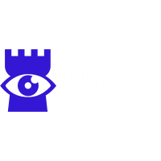

    
Capstone project for CS1980 at the University of Pittsburgh

Contributors:

* [Faaris Ismail](https://github.com/FaarisIsmail)
* [Andrew Francioni](https://github.com/ajf109)
* [John Fessler](https://github.com/Avaex)

# Overview

WAtSCE (Web Apps to Support Community Enablement) is a scheduling app created by Pitt students with the overarching goal of providing Hill District high school students with new opporunities to learn and apply digital skills. Teachers, local business owners, and community leaders are able to use WATSCE to create and post events for students to attend.

# Getting Started

## Please install the following on your machine:

Firebase CLI:
`npm install -g firebase-tools`

Dependancies:
``npm install``

## Running the app in local development mode
Run `npm start`
Open [http://localhost:3000](http://localhost:3000) to view it in the browser.

# Deploying Changes to the Site
This firebase project has been set up with Github Actions. To deploy changes to the live website, simply merge or commit changes to the `main` branch. Please allow a few minutes for changes to reflected on the site.

# Live Deployment Site
(https://watsce.tech/)
